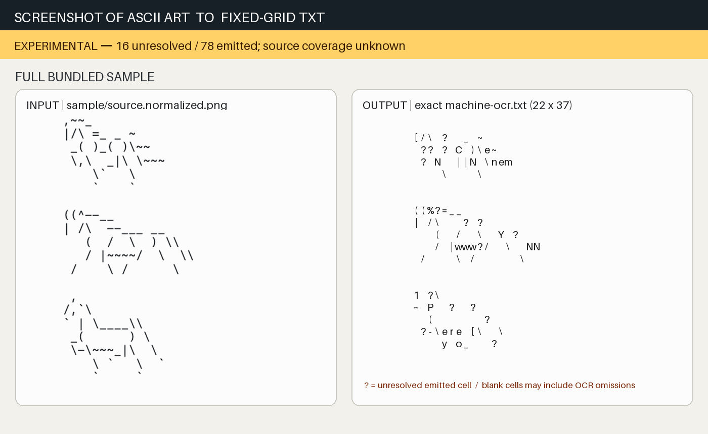
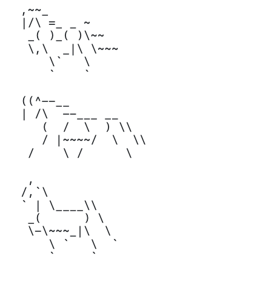

# Screenshot of ASCII Art to TXT Converter

Motivation: I would see cool ASCII art online or on Instagram, save a
screenshot for later, and end up with pictures of ASCII art but no real way to
convert them back to text.

**Experimental one-sample converter — not a general or accepted OCR system.**
This standalone extraction of LateLetter's fail-closed raster-to-ASCII tooling
measures a fixed character lattice, records Tesseract box evidence, and writes
`?` for unresolved cells instead of inventing glyphs.

**Status: acceptance hold.** This is an experimental OCR candidate generator,
not a completed ASCII recovery. With Tesseract 5.5.1, the 2026-08-12 re-audit
observed 40 unresolved `?` cells among 78 emitted non-space positions. That
output-only denominator cannot measure source glyphs omitted as blanks, so
source coverage remains unknown. The prior GIF was removed because it showed
shell commands and output rather than a human-judgeable recovery result.



The GIF contains no command-entry footage. Its first frame keeps the complete
bundled screenshot and complete 22-by-37 output together; the remaining three
frames enlarge matched calibrated row bands. Every frame carries the same HOLD.
The source, output, quality receipt, frame meanings, dimensions, durations, and
GIF hash are pinned in
[`docs/screenshot-to-txt-comparison.receipt.json`](docs/screenshot-to-txt-comparison.receipt.json).

## Run the bundled sample

Requirements: Python 3.11+, Tesseract, NumPy, and Pillow.

```sh
python3 -m pip install -r requirements.txt
./run-sample.sh /tmp/screenshot-of-ascii-art-to-txt-converter-output
```

The output directory must not already exist. A successful run creates:

- `machine-ocr.txt`
- `tesseract-boxes.json`
- `calibration.json`
- `quality.json`, which records emitted-output statistics, the Tesseract
  version, and an explicit `unknown_without_accepted_transcript` source-coverage
  state

The bundled horse-sheet sample produces 22 text rows. The result remains a
machine candidate; question marks are explicit unresolved cells.

## Judge the bundled result

The actual standalone product is the fixed-grid recovery candidate below: a
source raster goes in and a fail-closed 22-by-37 text grid comes out. It is not
the LateLetter application, and a shell transcript is not its acceptance
surface.

Bundled source:



Observed Tesseract 5.5.1 output on 2026-08-12, with trailing blank grid cells
omitted from this display only:

<!-- observed-output-start -->
```text

    [/\ ?  _ ?
     ?? ? ? )\??
     ? ?  ||? \???
        \    \


    ((??=__
    | /\   ? ?
       (  /  \  ? ?
       / |????/  \  ??
     /    \ /      \


    ? ?\
    ? ?  ?  ?
      (       ?
     ?-\??? [\  \
        ? ?_   ?
```
<!-- observed-output-end -->

This comparison is deliberately not labelled a pass. `quality.json` is the
machine-readable execution receipt; only an accepted transcript plus explicit
source-versus-output judgment could establish recovery quality.

## Reproduce the visual evidence

```sh
output_dir="$(mktemp -d)/recovery"
./run-sample.sh "$output_dir"
python3 scripts/generate_visual_evidence.py \
  --source sample/source.normalized.png \
  --machine-output "$output_dir/machine-ocr.txt" \
  --quality "$output_dir/quality.json" \
  --calibration sample/calibration.json \
  --gif /tmp/screenshot-to-txt-comparison.gif \
  --receipt /tmp/screenshot-to-txt-comparison.receipt.json
```

With the pinned dependencies and Tesseract 5.5.1, the generated GIF and receipt
must match the packaged hashes enforced by the contract tests.

## Boundary

This repository contains only the recovery script, one hash-bound sample image,
its calibration, the wrapper, a deterministic visual-evidence generator, and
focused tests. It excludes the LateLetter product, transcription pipeline,
session history, caches, and unrelated data.

See [docs/provenance.md](docs/provenance.md) for source identities and
[docs/DEPENDENCIES.md](docs/DEPENDENCIES.md) for the pinned runtime dependency
and license map.
